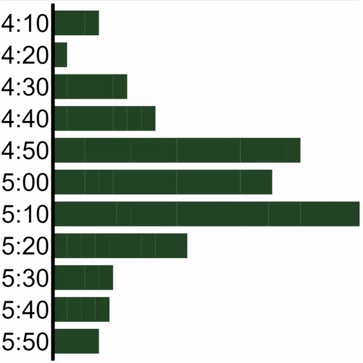
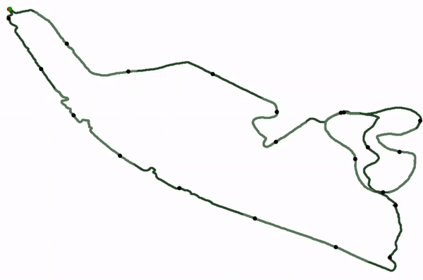
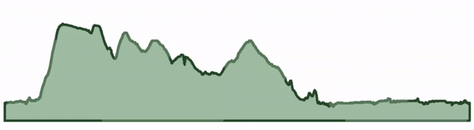

# GPS to SVG
Generate svg images of plots from data stored in *GPX* and *TCX* files.

RapidTables have a useful tool for visualising svg plots [Link](https://www.rapidtables.com/web/tools/svg-viewer-editor.html)

# Results

## Animated Histogram
Animated histogram of split times. In this example splits are added 1km at a time.

## Route
Plot of the route using GPS data.

## Elevation
Plot of the elevation along the route using GPS data.

## Installation
Install requirements using
`pip install -r requirements.txt`

# Usage

## Getting Data

### GPS Data to DataFrame
1. Pass path for gps file to `GPSReader.read()`
2. This returns two objects:
  - `list(dict)`, the parsed gps data.
  - `dict`, the parsed metadata.
3. Pass the `list(dict)` to `GPSReader.data_to_dataframe()` to convert it to a `pd.DataFrame`.

## Making Plots

### Route
1. Parse `pd.DataFrame` of gps file you want to plot.
2. Pass dataframe to `SVGMaker.generate_route_svg` with **optional** parameters:
  - `output_name` (`str`), name and relative path to where to output resulting file. (don't include extension!)
  - `route_styler` (`SVGMaker.RouteStyler`) styler for plot.
  - `html` (`bool`) whether to generate a html file which includes the generated plot. (This will be saved at `_output_name_.html`)
3. A `dict` will be returned which specifies which files where created.
  - `None` is returned if the dataframe included insufficient data.

# Reference

## GPX file
The following fields are available from a `.gpx` file after it is parsed by `GPSReader.read()`.
| field name | type | description |
|------------|------|-------------|
| `position_lat` | `float` | latitude position |
| `position_lon` | `float` | longitude position |
| `altitude` | `float` | altitude in metres |
| `time` | `datetime.datetime` | time and date of reading |
| `hr` | `int` | heart rate (not in all file) |

## TCX file
The following fields are available from a `.tcx` file after it is parsed by `GPSReader.read()`.
| field name | type | description |
|------------|------|-------------|
| `position_lat` | `float` | latitude position |
| `position_lon` | `float` | longitude position |
| `altitude` | `float` | altitude in metres |
| `time` | `datetime.datetime` | time and date of reading |
| `distance_to_point` | `float` | distance covered on route up to this reading (in metres) |
| `hr` | `int` | heart rate (not in all file) |

## Metadata
The following metadata is available from both `.tcx` and `.gpx` files parsed by `GPSReader.read()`.
| field name | type | description |
|------------|------|-------------|
| `sport` | `str` | name of sport activity represents |
| `date` | `datetime.datetime` | date on which activity occurred |
